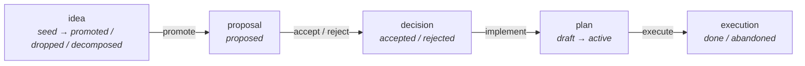
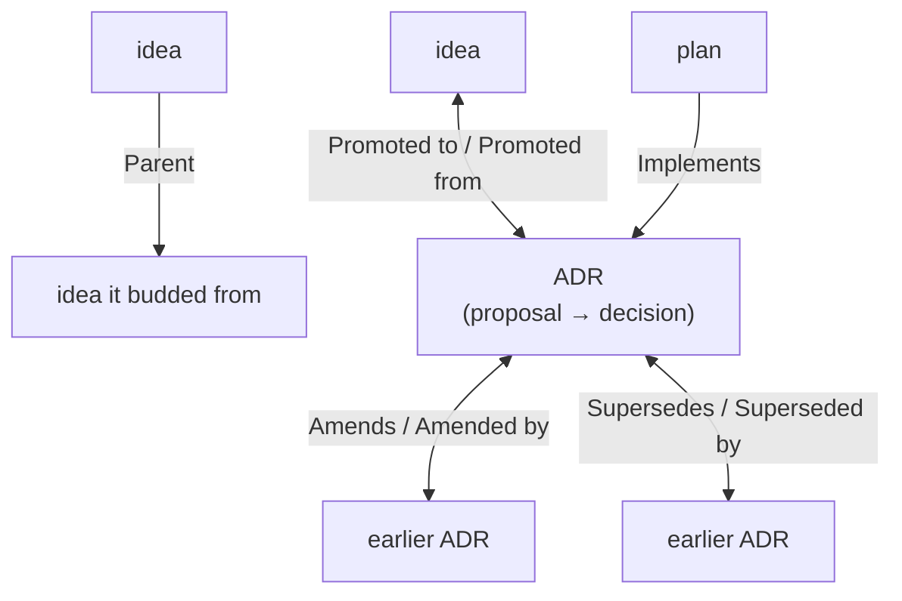

# A guide to working decision-trail

This is the narrative introduction to decision-trail. It tells you what the method
is, why it is shaped
the way it is, and how to use it day to day — teaching by walking one small
example (a dark-mode toggle) through its whole life, with a couple of diagrams
along the way. Once the ideas here are familiar, lean on the terse
[`AGENTS.md`](AGENTS.md) for quick lookups, and come back here for the human-facing
advice the spec doesn't carry.

<!--
Sync note — this file is a DERIVED rendering of `starter/docs/guide.md` (the
canonical guide). It is regenerated from the canonical, never hand-patched. It
differs from the canonical only by a closed set of deltas (ADR-0032, extending
ADR-0014):

  1. Paths — this repo uses repo-root families (`ideas/`, `decisions/`, `plans/`)
     where the canonical guide uses `docs/`-prefixed ones, and it points at this
     repo's `AGENTS.md` instead of the adopter's `docs/working-method.md`.
  2. Audience-forked sections — two sections carry home-repo-specific content that
     is correct for THIS repo and wrong for an adopter, so it must NOT be replaced
     by the canonical (adopter) text: "How to start" and "Where to go next". Each
     is bracketed below by `AUDIENCE-FORKED SECTION … BEGIN/END` markers.

Edit the canonical guide, then regenerate this file (regeneration rule below).
-->

<!--
Regeneration rule — how to rebuild this derived guide from `starter/docs/guide.md`
(mirrors the `AGENTS.md` derived-span pattern):

  • 1:1-derived sections (everything NOT between AUDIENCE-FORKED markers): take the
    canonical text and apply the path delta (delta 1) only — repo-root families
    instead of `docs/`-prefixed, `AGENTS.md` instead of `docs/working-method.md`.
  • Audience-forked sections (the spans between `AUDIENCE-FORKED SECTION … BEGIN`
    and `… END`): PRESERVE this file's existing text verbatim. Do NOT copy the
    canonical (adopter) wording over them, and do NOT flatten them to match the
    canonical — that is precisely what these markers guard against.

So a faithful regeneration overwrites every unmarked section from the canonical and
leaves the two marked sections (and these markers) untouched.
-->

## The problem it solves

You sit down to work on a project. You think hard, weigh options, decide
something, and act. Then the session ends — and with it goes the context: *why*
you chose this over that, what you'd already ruled out, where a half-formed idea
was heading. Next time you (or a teammate, or an agent) start almost from scratch,
re-deriving reasoning that was once clear.

decision-trail is a way of working that makes that context cheap to leave behind
and cheap to pick back up. It does so with nothing more than plain markdown files
in your repo — no app, no database, no proprietary tool. Anything you can read in
a text editor, you can resume from.

## The eight promises

The method holds itself to eight promises. They're worth reading once as a whole,
because every mechanic later is just one of these promises made concrete:

1. **Continuity** — you can pick up cheaply after the session ends and the context
   in your head is gone.
2. **Economy** — leaving and resuming context is cheap; artifacts are cheap to
   write and cheap to read.
3. **Transparency** — everything is plain, human-readable markdown. Nothing is
   hidden inside a tool you must run.
4. **Lifecycle for thoughts** — a thought can travel a defined path: idea →
   proposal → decision → plan → execution.
5. **Agility** — any thread can be refined or overthrown at any time. Nothing is
   locked.
6. **Budding** — one idea can spawn another, so a knot of entangled ideas can bud
   into one child per thread; the parent–child link is kept, so you can trace where
   a thought came from.
7. **Genericity** — none of this is bound to a particular project; it works for
   any.
8. **Borrow, don't invent** — wherever a portable standard already exists (ADRs,
   spec-driven stages, agent hand-off files), the method leans on it instead of
   inventing something proprietary.

## The ADR concept, by Michael Nygard

decision-trail doesn't invent its decision records — it borrows them. In 2011
Michael Nygard described the **Architecture Decision Record** (ADR): a small,
plain-text file that captures *one* significant decision, its context, and its
consequences, living alongside the code it affects. His original post remains the
seminal source:

- Michael Nygard, *Documenting Architecture Decisions* (2011) —
  https://www.cognitect.com/blog/2011/11/15/documenting-architecture-decisions

The idea caught on and grew a small ecosystem of templates, tooling, and
conventions:

- The ADR community hub, with templates and an overview —
  https://adr.github.io/
- Joel Parker Henderson's widely-referenced ADR collection and examples —
  https://github.com/joelparkerhenderson/architecture-decision-record

The classic Nygard template is deliberately tiny — **Status**, **Context**,
**Decision**, **Consequences** — which is exactly why it fits our promises:
cheap to write (Economy), plain markdown anyone can read (Transparency), and a
portable standard we lean on rather than reinvent (Borrow, don't invent). In
decision-trail an ADR is the middle of the lifecycle: a matured idea is *promoted*
into a proposal (`Status: proposed`), and the same file *becomes* the decision
when it's accepted. See [`decisions/`](decisions/) for this repo's own ADRs.

## The lifecycle: how a thought travels

The heart of the method is a single journey a thought can take, and it always
starts as an **idea**. That word is deliberately broad — an idea can be:

- a straight new requirement (*"we need a dark-mode toggle"*);
- a tiny passing thought;
- a question you can't yet answer;
- a big, still-fuzzy concept;
- the takeaway from a discussion with colleagues;
- an idea that turns out to be a whole knot of separate ideas tangled together;
- or just an observation that *something* might be improved.

If it's worth not losing, it's worth capturing as an idea — that's the whole point
of keeping them cheap. Not every idea goes all the way — most ideas stay ideas, and
that's fine — but the path is always the same, each stage has a home, and each
stage has its own set of *status* values:

Let's make it concrete by following one small example the whole way — **"add a
dark-mode toggle to a small web app"** — and watching it change shape at each
stage.

One thing to settle before we start, so nothing below alarms you: **you won't be
hand-writing any of these files.** Throughout the example, "you" *name and shape*
each artifact by talking it through — the agent is what actually drafts the
markdown and creates the file. Read every "you jot down…" / "you write…" below as
*"you describe it and the agent writes it up"*; the mechanics of who-types-what are
covered in full later on.

**Idea.** It starts as an *idea*: a cheap, small markdown file in `ideas/`. The
whole point is that ideas are cheap to write, so you write them down instead of
losing them. You jot down `ideas/0007-dark-mode-toggle.md`: *"People using the app
at night want a dark theme — a toggle in settings might help. Worth exploring."*
Its status is `seed`. That's the entire artifact — a seed, cheap to write. Most
ideas wait here like this one; some get `dropped`; a few mature.

And an idea needn't be a single, tidy thought — quite often it's really a *knot of
several entangled ideas*. That's fine, and it's expected: you don't have to
untangle it up front. When you're ready, it can **bud** into a child idea per
thread (each linked back with `Parent:`), and the original is marked `decomposed`
once its substance has moved into the children.

**Proposal.** The dark-mode idea gathers support, so you *promote* it. It becomes a
*proposal* — an [ADR](https://adr.github.io/) (Architecture Decision Record) in
`decisions/`, say `decisions/0009-dark-mode-toggle.md`, opened with `Status:
proposed`. (Notice the number jumped from `0007` to `0009`: numbers are just the
next free slot *within each family*, never matched across them.) In the ADR you
write the context (who needs it, which screens), weigh the options (auto-detect
the OS preference, offer a manual toggle, or do both), and state the one you
propose.

**Decision.** You talk it over and settle on *"a manual toggle that defaults to the
OS preference."* The proposal doesn't move to a new file — it *becomes* a decision
in place: you flip its status to `accepted` (it could just as easily have been
`rejected`). The same file now holds both the reasoning and the outcome, together
forever.

**Plan.** The accepted ADR says *what* and *why*, but not *how*. That's a *plan* in
`plans/` — `plans/0004-dark-mode-toggle.md` — which `Implements:` the decision and
breaks it into concrete tasks written as GitHub checkboxes: `- [ ] add a theme
context`, `- [ ] persist the choice`, `- [ ] add the settings toggle`.

**Execution.** Execution isn't a separate place — it's the plan in motion. You move
the plan from `draft` to `active`, then tick checkboxes as the work lands, until
the last box is checked and the plan is `done`. The dark-mode toggle has now
travelled its whole life — *idea → proposal → decision → plan → execution* — and
anyone can walk that trail later to see not just what shipped, but why.

## Budding: when one idea is really several

Not every idea is one thought. Sometimes, once you look closely, an idea turns
out to be a *knot of several separate ideas* tangled together — a big fuzzy
concept that braids two or three genuinely independent threads. The method has a
first-class way to handle this, and it's one of the eight promises: **budding**.

You don't force a tangled idea through as a single decision, and you don't have to
untangle it up front either. When you're ready, you let it **bud**: each separate
thread becomes its own child idea, linked back to the original with `Parent:`.
Each child then lives its own life — it can mature and be promoted 1:1 to its own
proposal, wait as a `seed`, or be `dropped` — entirely on its own timeline.

The original idea, once its substance has moved into the children, is marked
`decomposed`: a calm, honest end-state that says *"this wasn't rejected and it
wasn't a single decision — it fanned out into the children; follow the `Parent:`
links to find where it went."* Nothing is lost and no thread is rushed.

When and how to split is your call, in conversation with the agent — a good agent
will often notice the tangle and suggest budding it apart. The mechanics of the
`Parent:` link are covered next.

## The vocabulary of links

Artifacts don't just sit in folders; they point at each other, so you can follow a
trail from either end. The links are ordinary relative markdown links, but the
*field names* in the headers are fixed and greppable, so both humans and tools can
find them:

*Double-headed arrows are reciprocal (both files carry the link); single-headed
arrows are forward-only.*

- **`Parent:`** (idea → idea) — this idea budded from another one.
- **`Promoted to:`** / **`Promoted from:`** (idea ↔ ADR) — the idea matured into a
  proposal. This link is *reciprocal*: both ends carry it, because each end is
  single and written once.
- **`Amends:`** / **`Amended by:`** (ADR ↔ ADR) — a later decision changed part of
  an earlier one. Also reciprocal.
- **`Supersedes:`** / **`Superseded by:`** (ADR ↔ ADR) — a later decision replaces
  an earlier one wholesale. Also reciprocal.
- **`Implements:`** (plan → ADR) — this plan carries out a decision.

A rule of thumb decides when a link is reciprocal: add the back-link only when
*both* ends are single and write-once. `Promoted`, `Amends`, and `Supersedes`
qualify. `Parent` and `Implements` don't get a back-link, because their reverse
side accumulates — one parent can have many children, one decision can be carried
out by many plans — and you don't want to keep editing an old file every time a
new child appears.

A quiet but important rule: **you never edit a decision away.** When a decision
changes, you write a *new* ADR that amends or supersedes the old one and link them.
The old reasoning stays readable. The trail is a history, not a current-state
snapshot you overwrite.

## The overview

Because the real state lives scattered across many artifact files, there's one
derived convenience: `overview.md`. It's a single dated snapshot listing every
idea, decision, and plan with its creation date and current state — a plain
*to-do / what's-done* board.

Two things to know about it. First, it's **derived**: it is regenerated wholesale
from the artifact headers, never hand-patched, and stamped "as of <date>". The
artifacts are the truth; the overview is just a convenient mirror. Second, keeping
it current is the **agent's** job, not yours. If you flip a state directly in an
artifact, the next regeneration reconciles the overview. You can ask the agent to
regenerate it at any time.

## Tags: an optional cross-cutting axis

Any idea, decision, or plan may carry an optional `Tags:` header line —
comma-separated theme words that re-slice the work along a shared-theme axis, so
cross-cutting threads stay findable without reading every artifact in order. Tags
show up as a `Tags` column in the overview. The vocabulary is recommended, not
enforced, and curated per repo; a repo with no need simply uses no tags.

## The travel diary

Alongside the overview sits an optional, human-facing companion: the **travel
diary** (`travel-diary.md`). Where the overview is a terse, derived status board,
the diary is loose prose — a growing, newest-first logbook you can skim after a
break to catch up on *where we are, what changed, what's left, and what's next*.
It touches no artifact and is never a source of truth; adding a chapter is a
guard-free, informal task. A repo that doesn't want one simply has none.

Try it — you'll love it. It's informal, so there's just one habit worth forming:
before you end a session, say *"update the diary"*. Once this underrated little
helper is part of your routine, you'll miss it the moment you forget that last,
super-useful step.

## Intermediate artifacts

For the *execution* stage there's a second optional companion: an
**intermediate-artifacts** folder (`intermediate-artifacts/`) — a scratch space
where a plan can park material it gathers along the way (data, findings,
intermediate outputs) to work on later. Like the diary it's informal, guard-free,
and never a source of truth; it's committed by default so the material survives a
break, and a repo that doesn't need one simply has none.

<!-- AUDIENCE-FORKED SECTION (home-repo variant) — "How to start" — BEGIN.
     Per the sync note in this file's header and ADR-0032, this section is
     preserved on regeneration: do NOT overwrite it with the canonical (adopter)
     variant from starter/docs/guide.md. -->
## How to start

**First, get the method into your project.** decision-trail lives in its own
standard repo. To adopt it, `git clone` (or `git pull` for the latest) the
[decision-trail repo](https://github.com/haevg-rz/decision-trail), then follow its
[`adopting.md`](adopting.md) on-ramp — it walks you through dropping the `starter/`
skeleton into your repo (whether the repo is brand new or already has code) and
recording which version you adopted. That is a one-time setup.

Once your repo owns its `ideas/`, `decisions/`, and `plans/` families, the everyday
rhythm is just the lifecycle:

1. Capture a thought as an idea in `ideas/`.
2. When it matures, open an ADR in `decisions/` with `Status: proposed`.
3. Accept or reject it; an accepted ADR is a decision.
4. Write a `plans/` file that `Implements:` the decision and lists tasks.
5. Execute by moving the plan `active` → `done`, ticking checkboxes.
<!-- AUDIENCE-FORKED SECTION — "How to start" — END. -->

## Working with an agent: a conversation, not a command line

If you come from classic development, your instincts are finely tuned for
*precision*: exact syntax, type-safety, schemas, well-named parameters and
arguments, a compiler that rejects anything ambiguous. That rigor is a superpower
when you're writing code — and it is exactly the wrong reflex here.

Working with an AI on decision-trail has **no command to memorize, no API surface,
no schema, no flags**. There is nothing to get syntactically "right." The interface
is a conversation, and the skill is *conversing* — prompting, explaining,
discussing, pushing back.

So don't hunt for the magic incantation; open a dialogue. Treat the AI as a
**co-pilot and consultant**, not a code-generator you invoke. Tell it what you're
trying to do and *why*. Think out loud. Ask it to argue the other side, to poke
holes in your reasoning — and be healthily skeptical of its first answer in return.
The best results come from an intellectual, slightly adversarial back-and-forth,
not from a perfectly-phrased request.

And here's the part that lifts the real burden: **the agent writes every markdown
file for you.** You never hand-craft an artifact. You throw in a rough description
of your idea — as precise as you can make it *right now*, but never mind the
wording, the typos, or the structure — and simply say *"make this an idea."* The
agent turns it into a well-structured, readable document, finds the next free slot
in `ideas/`, and creates the file — often after asking you a few clarifying
questions first. The same goes for every artifact that follows: the proposal, the
decision, the plan. You talk your way through the work, and the persisted artifacts
come out with a consistency and polish you could rarely reach by hand — and you no
longer have to.

This is genuinely liberating once it clicks: you don't have to phrase things exactly
right, because you can always refine on the next turn. Ambiguity isn't an error to
be rejected — it's the opening of a conversation. decision-trail is built for
exactly this rhythm: ideas are cheap, proposals are debated, decisions are reasoned
in the open. The one guardrail on all that free-flowing conversation is the
confirmation guard — which is what the next section is about.

## Working with an agent: a "yes" has a scope

When an AI agent does the work, one rule protects you above all others: the
**confirmation guard** — the agent discusses and proposes freely, but does not
*act* (write, edit, implement) until you give an explicit green light. It is the
seam between thinking and doing.

Here is the uncomfortable truth worth internalizing: **that guard is never
perfectly safe, and cannot be.** The rule is sound; the weak point is the *word you
answer with*. A bare "yes", "ok", or "go on" carries an unavoidable ambiguity of
**scope** — did you approve *just this one next step*, or the whole logical batch
that step obviously *implies*? You and the agent can each hold a different, silent
answer. The words matched; the intended scope did not. That is exactly how a
narrow "yes" to one design choice can be read as blanket approval to draft an idea,
write the decision, *accept* it, plan it, and implement the lot in a single sweep.

It is tempting to think decision-trail's **step-by-step** nature makes this
impossible. It does help — small artifacts and explicit stages give many natural
places to pause. But do not let it lull you into a false sense of safety: the guard
only truly binds when *both sides share the same picture of what a given
confirmation covers*. A step-by-step method with ambiguous "yes"es still lets a
whole batch slip through on one word.

So treat scope as a **shared responsibility**, negotiated in the confirmation
itself:

- **The agent** should, before acting, take a short look at *what it thinks it is
  confirming* against *what you might think you confirmed* — and when those could
  diverge, state its intended scope plainly instead of assuming the larger batch.
- **You**, when the scope is at all unclear, should bound the approval in words
  rather than answering with a bare "yes". A few extra words —
  *"yes, but only this single next step [...]"* — are far cheaper than a rollback.

## Working with an agent: resuming cheaply

**Economy** (promise #2) isn't only about the artifacts being cheap to write — it's
about them being cheap to *resume*. Today the one doing the resuming is usually an
AI agent, and its real running cost is **tokens and context budget**. The trail is
deliberately built so that catching up is cheap: the overview is a derived index,
the travel diary is a one-file catch-up, and every artifact carries fixed,
greppable header fields. The agent already knows how to exploit all that — read the
index first, grep headers instead of whole bodies, open only the files it actually
needs. That side is handled for you.

What's left is a handful of levers that only *you* control — small habits that
decide whether a resume costs a few reads or a march through the whole corpus:

- **How you re-open the session is the biggest lever.** *"We're resuming plan 0007
  — read its file and the overview"* costs a few targeted reads. *"Catch me up on
  the project"* invites reading everything. Same information need, wildly different
  cost.
- **Name the artifact, not the topic.** *"What does ADR-0021 decide?"* opens one
  file. *"What did we decide about token weight?"* sends the agent searching across
  bodies. If you know the number, give it.
- **Ask narrow.** A scoped question — *"what's the status of the active plan?"* —
  maps to a quick header lookup; an open-ended one invites a synthesis over the
  whole trail.
- **Invest at pause-time, not resume-time.** A regenerated overview and a
  one-paragraph travel-diary chapter, written while the context is still fresh in
  the session, are what make the *next* resume cheap. The minute you spend before a
  break pays back every time someone picks the thread up again.
- **Terseness is your discipline too.** You author and green-light every artifact.
  Terse ones are cheaper to write *and* cheaper to resume — economy compounds on
  both ends.

None of this is enforced, and ignoring it breaks nothing — it only ever spends more
tokens than it needed to. Think of it as good travel habits: pack light, label your
bags, and leave a note for whoever arrives next.

<!-- AUDIENCE-FORKED SECTION (home-repo variant) — "Where to go next" — BEGIN.
     Per the sync note in this file's header and ADR-0032, this section is
     preserved on regeneration: do NOT overwrite it with the canonical (adopter)
     variant from starter/docs/guide.md. -->
## Where to go next

- [`AGENTS.md`](AGENTS.md) — the terse reference: the same contract, lifecycle,
  layout, and vocabulary, condensed into tables for quick lookup once you know
  your way around. It also carries the **agent operating guidance** (how an AI
  agent should behave in this repo).
- [`decisions/`](decisions/) — read in order, it shows *why* the method is the way
  it is: decision-trail documents its own construction.
- [`adopting.md`](adopting.md) — the on-ramp for using decision-trail in **your own
  repo**: how to start fresh, inject it into an existing repo, or update to a newer
  version.
<!-- AUDIENCE-FORKED SECTION — "Where to go next" — END. -->
